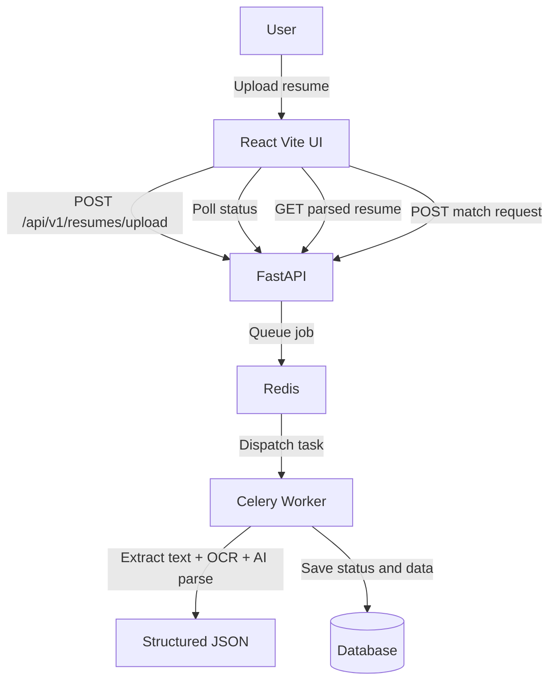

# Resume Analyzer and Job Description Matcher

An asynchronous resume parsing and matching platform built with FastAPI, Celery, Redis, and React (Vite). The system accepts resume files, extracts and structures candidate information, and compares the result against a job description using Gemini.

## Table of Contents
- [Overview](#overview)
- [Core Features](#core-features)
- [Tech Stack](#tech-stack)
- [Architecture](#architecture)
- [Local Setup](#local-setup)
- [Running the Application](#running-the-application)
- [Frontend](#frontend)
- [API Endpoints](#api-endpoints)
- [Project Structure](#project-structure)

## Overview
This project provides:
- Asynchronous resume ingestion.
- Background file processing for OCR and text extraction.
- AI-based structured JSON generation.
- Resume-to-job matching with scoring and explanation output.

The backend API remains responsive while CPU- and AI-intensive steps run in Celery workers.

## Core Features
- Resume upload via API (`/api/v1/resumes/upload`).
- Processing status tracking (`pending`, `processing`, `completed`, `failed`).
- Parsed structured resume output retrieval.
- Job description matching endpoint with detailed AI response.
- Multi-format support: PDF, DOCX, TXT, JPG, PNG.

## Tech Stack
| Layer | Technology |
| :--- | :--- |
| API | FastAPI (Python) |
| Worker Queue | Celery |
| Message Broker | Redis |
| Database | SQLAlchemy (SQLite local default) |
| AI | Google Gemini (`google-generativeai`) |
| Frontend | React + Vite |
| Testing | Pytest |

## Architecture


## Local Setup
1. Create and activate virtual environment:
   ```bash
   python -m venv venv
   # Windows
   venv\Scripts\activate
   # macOS/Linux
   source venv/bin/activate
   ```
2. Install backend dependencies:
   ```bash
   pip install -r requirements.txt
   ```
3. Create environment file:
   ```bash
   copy .env.example .env
   ```
4. Set `GEMINI_API_KEY` in `.env`.
5. Start Redis locally at `localhost:6379`.

## Running the Application
Run backend API:
```bash
uvicorn src.main:app --reload --host 0.0.0.0 --port 8000
```

Run Celery worker (new terminal, same virtualenv):
```bash
celery -A src.worker.celery_app.celery_app worker --loglevel=info
```

API docs:
```text
http://localhost:8000/docs
```

## Frontend
From the `frontend` directory:
```bash
npm install
npm run dev
```

Vite is configured to proxy `/api` requests to `http://localhost:8000`.

## API Endpoints
- `POST /api/v1/resumes/upload`  
  Upload a resume file (multipart form field: `file`).

- `GET /api/v1/resumes/{id}/status`  
  Check processing status for a resume job.

- `GET /api/v1/resumes/{id}`  
  Fetch structured parsed resume JSON after completion.

- `POST /api/v1/resumes/{id}/match`  
  Match parsed resume against a job description payload.

## Project Structure
```text
Resume-Parser/
├── Readme.md
├── requirements.txt
├── setup.sh
├── .env.example
├── docs/
├── src/
│   ├── main.py
│   ├── api/
│   ├── core/
│   ├── db/
│   └── worker/
├── tests/
└── frontend/
```


