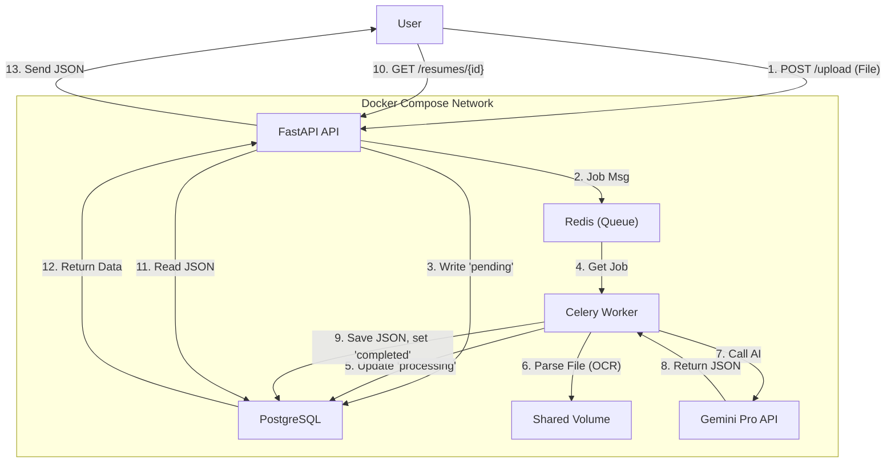

# 🚀 AI-Powered Resume Parser (Hackathon Submission)

This is a high-performance, asynchronous resume parsing API built for the AI-Powered Resume Parser Hackathon.

It features a robust backend built with **FastAPI** and a distributed task queue using **Celery** and **Redis**. It ingests multiple document formats (including scanned PDFs via **Tesseract OCR**), extracts raw text, and then uses the **Google Gemini Pro** model to parse that text into a clean, structured JSON format that matches the hackathon's required data models.

The entire system is containerized with **Docker** for one-command setup and deployment.

---

## Project Documentaion & Test Walkthrough
```bash
https://docs.google.com/document/d/1KPKhS36GDSsyG8A5lRmLcb15LSeg11D1/edit?usp=sharing&ouid=104083747354714194741&rtpof=true&sd=true
```
Resume Used
```bash
https://drive.google.com/file/d/1cT-61-73FdIPDPrqyFB7zLml0x72b6Tg/view?usp=sharing
```


---

## Table of Contents
1. [Project Overview](#project-overview)
2. [Features](#features)
3. [Tech Stack](#tech-stack)
4. [System Architecture](#system-architecture)
5. [Installation & Setup](#installation--setup)
6. [Running Locally (No Docker)](#running-locally-no-docker)
7. [Project Structure](#project-structure)
8. [API Endpoints](#api-endpoints)
9. [Database Schema](#database-schema)
10. [Future Enhancements](#future-enhancements)

---

## 🧠 Project Overview

This project implements a scalable, asynchronous API for parsing resumes. When a file is uploaded, the API instantly returns a job ID. A separate background worker picks up the job, performs text extraction (including OCR), calls the Google Gemini AI to analyze the text, and stores the resulting structured JSON in a PostgreSQL database.

This architecture ensures the API is fast and responsive, capable of handling many uploads, while the heavy AI processing happens in the background.

- api (FastAPI): The web server. Handles all HTTP requests, validates input, and serves the final JSON.

- worker (Celery): The background process. Listens for jobs from Redis and performs all slow tasks (OCR, AI calls).

- redis (Redis): The message broker. Acts as the "to-do list" between the api and the worker.

- db (PostgreSQL): The database. Stores all file info and the final structured JSON from the AI.

---

## ✨ Features

- 📤 **Asynchronous Upload API** — The `/upload` endpoint responds instantly (<50ms) by queueing jobs in Redis.
- ⚙️ **Background Processing** — A **Celery** worker handles all heavy lifting, ensuring the API never blocks.
- 📄 **Multi-Format Parsing** — Supports all required formats:
    - **Text-based PDFs** (via `pdfplumber`)
    - **Scanned/Image PDFs** (via `Tesseract OCR` fallback)
    - **Word Documents** (via `python-docx`)
    - **Plain Text** (via `open()`)
    - **Image Files** (`.jpg`, `.png`) (via `Tesseract OCR`)
- 🧠 **AI-Powered Extraction & Analysis** — Uses the **`gemini-2.5-pro`** model for accurate text-to-JSON conversion.
- 🔒 **Guaranteed Structured Output** — Leverages Gemini\'s "Structured Output" feature (`response_schema`) to *force* the AI to return JSON that perfectly matches the hackathon\'s Pydantic schemas.
- 💡 **AI Enhancements** — The AI also generates the `aiEnhancements` block, including `qualityScore`, `completenessScore`, `industryFit`, and `careerProgressionAnalysis`.
- 🏁 **Resume-Job Matching** — A high-scoring "Nice-to-Have" endpoint (`POST /resumes/{id}/match`) that compares a processed resume against a new job description and returns a full AI-generated analysis.
- 🧪 **API Testing** — Includes a `pytest` suite to run automated tests against the running API (checks health, file size limits, and task mocking).

---

## 🛠 Tech Stack

| Component | Technology | Purpose |
| :--- | :--- | :--- |
| Component | Technology | Purpose |
| :--- | :--- | :--- |
| **Backend API** | **FastAPI (Python)** | High-performance, async API framework. |
| **Database** | **PostgreSQL** | Persistent storage for metadata and `JSONB` data. |
| **Task Queue** | **Celery** | Distributed task queue for background processing. |
| **Message Broker**| **Redis** | In-memory broker for Celery tasks. |
| **AI Model** | **Google Gemini** | `gemini-1.5-flash-latest` for high-speed structured data. |
| **Parsing** | `pdfplumber`, `python-docx` | For extracting text from `.pdf` and `.docx` files. |
| **OCR** | `pytesseract`, `pdf2image` | For extracting text from scanned PDFs and images. |
| **Containerization**| **Docker & Docker Compose**| To build and run all 4 services (`api`, `worker`, `db`, `redis`). |

---

## 🧩 System Architecture

This project uses a 4-container architecture, orchestrated by Docker Compose.

---

## ⚙️ Installation & Setup

### Clone the Repository
```bash
git clone https://github.com/AyushSrivastava/resume-parser-hackathon.git
cd resume-parser-hackathon
```
### Create a Virtual Environment
```bash
python -m venv venv
source venv/bin/activate     # On Mac/Linux
venv\Scripts\activate        # On Windows
```
### Install Dependencies
```bash
pip install -r requirements.txt
```
### Configure Environment Variables
Create a .env file in the root directory:
```bash
cp .env.example .env
```
You must provide a Google Gemini API key.
```bash
GEMINI_API_KEY="Your-API-Key"
```

### Run the Application
Access API docs at:
```bash
http://localhost:8000/docs
```
---

## Running Locally (No Docker)

To run the API and worker directly on your machine without Docker:

1. **Install system dependencies** (for OCR and PDF handling), e.g. Tesseract and poppler (installation steps depend on your OS).
2. **Start Redis** on `localhost:6379`.
3. **Create and activate a virtual environment** (see [Installation & Setup](#installation--setup)).
4. **Run the FastAPI app**:
```bash
uvicorn src.main:app --reload --host 0.0.0.0 --port 8000
```
5. **In a second terminal, run the Celery worker**:
```bash
celery -A src.worker.celery_app.celery_app worker --loglevel=info
```

Once both are running, the API docs are available at:
```bash
http://localhost:8000/docs
```

---

## 📁 Project Structure
```bash
/
├── README.md                 # This file
├── setup.sh                  # Setup script for local venv (for linting/editor)
├── requirements.txt          # All Python dependencies
├── .env.example              # Example environment file
├── .gitignore                # To ignore venv, .env, __pycache__
|
├── docs/
|   ├── api-specification.yaml  # The full OpenAPI 3.1.x spec (auto-generated)
|   └── architecture.md         # The architecture diagram and description
|
├── src/
|   ├── main.py               # Main FastAPI app entry point
|   ├── core/
|   |   └── config.py           # Loads settings from the .env file
|   ├── db/
|   |   ├── models.py           # SQLAlchemy database tables
|   |   └── session.py          # Database connection logic
|   ├── api/
|   |   ├── v1/
|   |   |   ├── api.py            # Main router for all v1 endpoints
|   |   |   ├── schemas.py        # Pydantic models for API responses
|   |   |   └── endpoints/
|   |   |       └── resumes.py      # All logic for /resumes/... routes
|   └── worker/
|       ├── celery_app.py     # Celery application setup
|       └── tasks.py          # The background job (parsing, OCR, AI)
|
└── tests/
    └── test_api.py           # Pytest integration tests
```
---

## 🧾 API Endpoints
### Upload Resume

POST /api/v1/resume/upload

Description: Upload a resume file (PDF or DOCX) to parse.

Request:

Content-Type: multipart/form-data

File: resume

Response Example:
```bash
{
  "message": "Resume uploaded and parsed successfully.",
  "data": {
    "name": "John Doe",
    "email": "john@example.com",
    "skills": ["Python", "FastAPI", "SQL"],
    "experience": [
      {"company": "ABC Corp", "role": "Backend Developer", "years": 2}
    ]
  }
}

```
### GET /api/v1/resumes/{id}/status
Description: Checks the status of a job (pending, processing, completed, or failed).

Response Example:
```bash
{
  "id": "a1b2c3d4-e5f6-7890-abcd-1234567890ef",
  "status": "completed",
"fileName": "AyushSrivastava_Resume.pdf",
  "uploadedAt": "2025-11-05T07:10:12.107512Z",
  "processedAt": "2025-11-05T07:10:48.087159Z"
}
```
### Get Resume by ID
GET /api/v1/resume/{id}

Description: Fetch details of a specific resume.

Response Example:
```bash
{
  "id": 3,
  "name": "Alice Brown",
  "email": "alice@xyz.com",
  "skills": ["C++", "DSA", "Flask"]
}
```

### POST /api/v1/resumes/{id}/match (Advanced Feature)
Description: Compares a processed resume against a new job description.

Request Body: A JobDescription JSON object (see spec).

Response: A full MatchResponse JSON object with an overallScore, gapAnalysis, explanation, and more.

---
--🗄️ Database Schema
A single resumes table is used. The AI-generated data is stored in the structured_data JSONB column, which is highly scalable and matches the "Data Models" spec.
```bash
CREATE TABLE resumes (
    id UUID PRIMARY KEY,
    file_name VARCHAR(255) NOT NULL,
    file_size INTEGER NOT NULL,
    file_type VARCHAR(255) NOT NULL,
    file_hash VARCHAR(128) UNIQUE NOT NULL,
    file_path VARCHAR(512),
    uploaded_at TIMESTAMP,
    processed_at TIMESTAMP,
    processing_status VARCHAR(50) DEFAULT 'pending',
    raw_text TEXT,
    structured_data JSONB,
    created_at TIMESTAMP,
    updated_at TIMESTAMP
);
```
---

## 🔮 Future Enhancements

🤖 AI Scoring Engine — Use Gemini API to evaluate resumes based on role requirements.

🧠 Job-Resume Matching — Intelligent candidate ranking.

📊 Dashboard UI — Interactive visualization of parsed data.

📈 Admin Panel — Resume management & analytics.

☁️ Cloud Deployment — Host on Render or AWS ECS.


